<h1 id="-english"></h1>

  
# Official Documentation: TenshoScripts v2.0.0

Welcome to the **TenshoScripts** manual. This toolkit was created to make your life easier when animating subtitles. Our main focus is to streamline and professionalize the subtitle workflow specifically for **YouTube**. Our engine ensures that your subtitles never break or get displaced while applying complex effects.

---

## 📑 Tool Index

**⚙️ Settings**
* [0. Global Settings](#0-global-settings)

**🟢 Free Tools**
* [1. Adapted Fadeworks](#1-adapted-fadeworks)
* [2. Easy Gradient](#2-easy-gradient-multi-point)
* [3. Flashes](#3-flashes)
* [4. Split Lines](#4-split-lines)
* [5. Transform (\t)](#5-transform-t)
* [6. Text & Fonts FX](#6-text--fonts-fx)
* [7. Fix Lines](#7-fix-lines)
* [8. YtktFade](#8-ytktfade)
* [9. Number Counter](#9-number-counter)
* [10. Shake](#10-shake)
* [11. Color Tracker](#11-color-tracker)

**💎 TenshoScripts + (Exclusive)**
* [12. Dynamic Glitch](#12-dynamic-glitch-paid)
* [13. Rainbow Wave](#13-rainbow-wave-paid)
* [14. KaraFX (Karaoke & ReverseK)](#14-karafx-karaoke--reversek-paid)
* [15. Curves [BETA]](#15-curves-paid---beta)

---

## 0. Global Settings
Where you customize how the script behaves in your Aegisub.

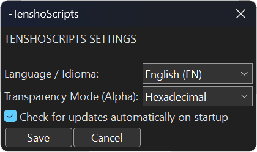

### How the options work:
* **Language / Idioma:** Changes the language of all buttons and warnings (English or Portuguese).
* **Transparency Mode (Alpha):** How you prefer to type transparency values inside the tools. It can be Aegisub's native hexadecimal code (e.g., `&HFF&`) or a simple percentage from `0 to 100%`.
* **Check for updates automatically:** If checked, the script searches the internet every time you open it to see if there are new features and downloads them automatically.

---

## 1. Adapted Fadeworks
Fadeworks makes your text appear and disappear smoothly (Fade In / Fade Out).

### How the buttons work:
* **Fade In / Fade Out:** The time the text takes to fully appear at the beginning and fade out at the end. 
  * *Golden Tip:* Instead of typing milliseconds (e.g., `500`), you can type a decimal value (like `0.8`). This makes the fade last exactly **80% of the line's total time**, no matter its duration!
* **Alpha / Colour:** If you choose **Alpha**, the text will just fade in transparency. If you choose **Colour (From/To)**, the text will crossfade from one color to another as it appears.
* **By Letter:** Instead of the whole line fading at once, each letter will fade in one after the other.
* **Direction:** The order the letters will appear (Left to Right, Right to Left, etc.).

---

## 2. Easy Gradient (Multi-Point)
Paints your subtitle with a horizontal gradient. Works perfectly even if you select multiple lines at the same time.

  <table>
    <tr>
      <td align="center" width="50%">
        <strong>Manual Gradient</strong> 
        
      </td>
      <td align="center" width="50%">
        <strong>Gradient by Style</strong> 
        
      </td>
    </tr>
  </table>

### How the buttons work:
* **Colors (1 to 5):** Choose the colors that will form the gradient. Enable the extra color checkboxes for complex setups.
* **Interpolate HSL:** Keep this checked! It makes the color blending look vibrant, preventing grayish or muddy tones in the middle.
* **Target Checkboxes:** Choose where the color will be applied: Inside the text (`\c`), on the border (`\3c`), or the shadow (`\4c`).
* **Styles Tab:** Tell the script to create a gradient pulling colors straight from your Aegisub Styles (e.g., "Start with Style A's color and end with Style B's color").

---

## 3. Flashes
Makes your subtitle blink rapidly in another color. Perfect for visual impacts synced with heavy music beats.

### How the buttons work:
* **Flash Color:** The color the text will turn into when it "blinks".
* **Interval (ms):** The speed of the blinks. Smaller number = Faster.
* **Smooth Transition:** If unchecked, it cuts abruptly (strobe style). If checked, the color pulses smoothly.

---

## 4. Split Lines
Cuts an entire sentence and turns each letter or word into a separate line without moving them from their original spot.

### How the buttons work:
* **Split by Character:** Separates letter by letter.
* **Split by Word:** Separates cutting at the spaces.

---

## 5. Transform (\t)
Automatically animates changes in colors, sizes, and transparency over time.

### How the buttons work:
* **Start and End (ms):** Defines the exact time the animation happens. If you leave the end at zero, it uses the total line duration.
* **Colors and Size:** Check what you want to change and its final value. (e.g., checking Font `\fs` to `150` makes the text smoothly grow to that size).

---

## 6. Text & Fonts FX
A text animation generator focused on typography.

### Available Effects:
* **Random Fonts:** Rolls random fonts. The script automatically adjusts their size so a naturally small font doesn't look "squeezed" next to a big one.
* **Typewriter:** Makes the text type out on the screen.
* **Unscramble (Hacking):** Shows rolling random symbols before revealing the true letter.
* **Chaos:** The text randomly "corrupts" itself with bizarre symbols throughout the line duration.
* **Invert:** Mirrors the text backwards.
* **Dynamic Jump (Center):** Makes the text constantly re-center itself on the screen with every new letter typed, without pushing the rest of the sentence.

---

## 7. Fix Lines
Fixes the positioning of your subtitle, converting it to absolute screen coordinates using `\pos`.

### How the buttons work:
* **Force Top/Mid/Bottom:** Ignores where the text was and forces it exactly to the mathematical center of the screen (Top, Center, or Bottom).

---

## 8. YtktFade
A tool made exclusively for uploaders who use "Invisible" karaoke on YouTube.

### How the buttons work:
* **Constant Alpha:** Injects the correct codes so that YouTube's renderer doesn't leave the karaoke's border jagged during compression.
* **Enable \2c:** Selects the secondary background color for the karaoke.

---

## 9. Number Counter
Generates animated numbers automatically. Great for loading bars, statistics, or timers on screen.

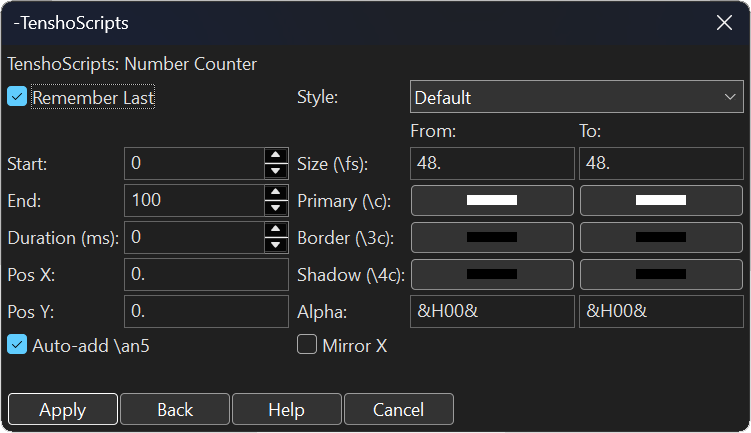

### How the buttons work:
* **Start / End:** Where the number begins and where it stops (e.g., 0 to 100).
* **Duration (ms):** Time it takes to count. If left at `0`, it counts during the entire line duration.
* **Pos X / Pos Y:** The exact coordinates on the screen where the counter will appear.
* **Auto-add \an5:** Perfectly centers the number at the chosen position.
* **From -> To (Size/Colors):** You can make the number grow (Size `\fs`), change its primary color, border, shadow, or fade in (Alpha) while it counts!

---

## 10. Shake
Makes the subtitle shake on the screen, simulating a camera shake. The script automatically generates the movements by creating several `\pos` coordinates.

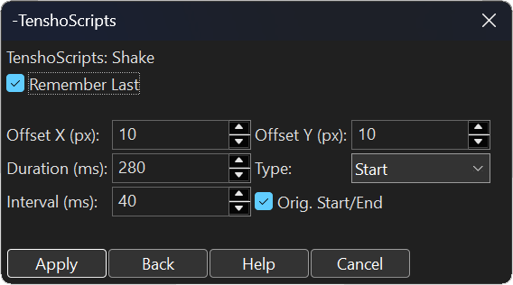

### How the buttons work:
* **Offset X and Y (px):** The maximum pixels the text can jump sideways (X) and up/down (Y).
* **Duration (ms):** The total time the shake will last.
* **Interval (ms):** The frequency. A low interval (e.g., `40`) makes a fast and violent shake, a high interval makes a slow rocking motion.
* **Type:** Where the shake happens (e.g., at the "Start" of the line, at the end, etc.).
* **Orig. Start/End:** Keeps the original line timings without shifting the grid.

---

## 11. Color Tracker
*(Original base credits: [Zahuczky](https://github.com/Zahuczky/Zahuczkys-Aegisub-Scripts))*

A continuous "eyedropper". It tracks (follows) the color changes of a single specific pixel on your screen and applies that color to your subtitle.

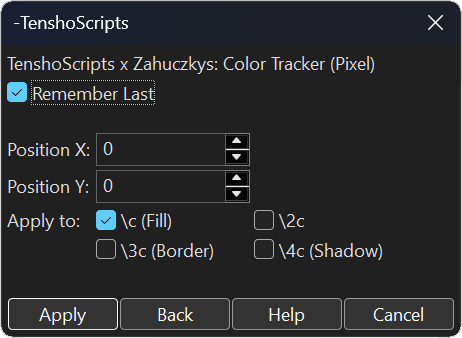

### How the buttons work:
* **Position X and Y:** The exact point on the screen the script will watch.
* **Apply to:** Choose which part of your text will receive this tracked color from the video:
  * `\c (Fill)`: The inside of the text.
  * `\2c`: The secondary (karaoke) color.
  * `\3c (Border)`: The border.
  * `\4c (Shadow)`: The shadow.

---

## 12. Dynamic Glitch (Paid)
Creates the famous "Digital Failure" or Chromatic Aberration effect. It duplicates the text borders in different colors and makes them split and shake.

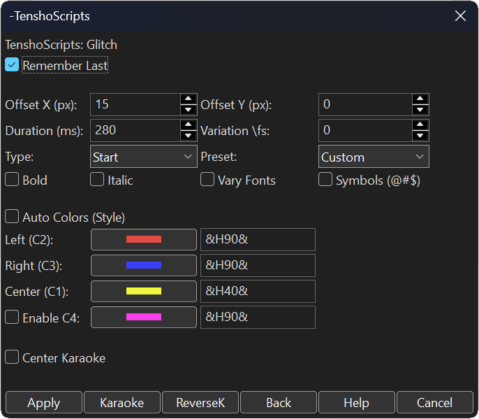

### How the buttons work:
* **Offset X and Y (px):** The maximum distance the fake colors will separate from the original text (sideways or up/down).
* **Duration (ms):** The time the effect will last on screen.
* **Variation \fs:** Makes the text size randomly "jump" (grow and shrink) during the glitch.
* **Type:** Choose if the glitch happens at the **Start** of the line, at the **End**, or **Always** (the entire time).
* **Effect Checkboxes (Bold, Italic, Vary Fonts, Symbols):** Makes the text flicker by changing fonts or turning into random symbols (`@#$`) to look like a truly corrupted video file.
* **Auto Colors (Style):** Pulls the colors straight from your Aegisub Style. If unchecked, you can manually choose the color that will flash on the **Left**, **Right**, and **Center** of the text, along with their transparency (`Alpha`).
* **Center Karaoke:** If your glitch is happening syllable by syllable using the `\k` tag, this option ensures the word jumps to the center of the screen.

---

## 13. Rainbow Wave (Paid)
Makes a wave of color sweep smoothly across your text, gliding across letters like water, without creating thousands of heavy overlapping layers in Aegisub.

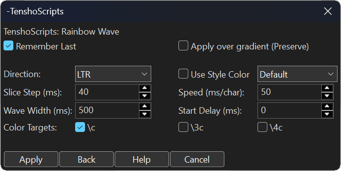

### How the buttons work:
* **Direction:** Where the wave travels (Left to Right, etc.).
* **Slice Step (ms):** The cut precision. We recommend leaving it at `40` for an extremely smooth movement that won't lag your PC.
* **Wave Width (ms):** The "size" of the wave. Larger values make the color take longer to cross the word.
* **Speed (ms/char):** The time the wave takes to jump from one letter to the next.
* **Apply over gradient (Preserve):** Check this if your text already has an original gradient and you don't want the wave to destroy it as it passes.
* **Use Style Color:** Instead of a standard colorful rainbow, the wave will use a color from your style (like the primary or secondary), acting as a "glow" that sweeps through the text.

---

## 14. KaraFX (Karaoke & ReverseK) [Paid]
Automates advanced effects for those who sync syllables using the `\k` tag. Replaces old karaoke plugins that used to break text layouts.

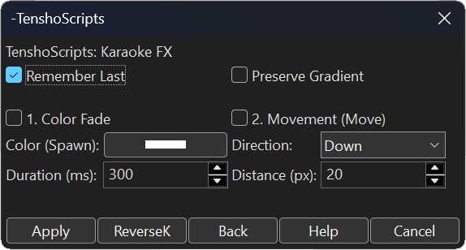

### How the buttons work:
* **1. Color Fade:** Makes the syllable change color *smoothly* when sung (unlike the hard, dry switch of normal karaoke). You set the Spawn Color and the time.
* **2. Movement (Move):** Makes the syllable give a little "jump" in the chosen direction (Down, Up, Left, Right) and the configured Distance in pixels as soon as it's sung.
* **Preserve Gradient:** Ensures the above effects don't destroy your text's original gradient.
* **"ReverseK" Button (Reverse Karaoke):** Ignores the effects above and does the exact opposite of traditional karaoke: the entire text starts on screen and **vanishes** (dims) syllable by syllable in the exact rhythm of the `\k`.

---

## 15. Curves [Paid] - BETA
Brings the professional smooth movement of software like Premiere and After Effects straight into Aegisub's `\move` tag.

  <table>
    <tr>
      <td align="center" width="50%">
        <strong>Basic Mode</strong> 
        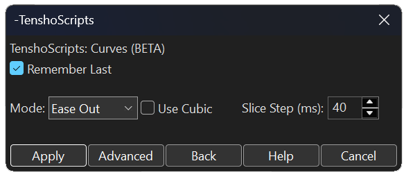
      </td>
      <td align="center" width="50%">
        <strong>Advanced Mode (Bézier)</strong> 
        
      </td>
    </tr>
  </table>

### How the buttons work:
* **Presets (In, Out, In-Out):** Ready-to-use accelerations. (Starts slow and ends fast, elastic bounce, etc.).
* **Advanced Mode (Bézier):** Allows you to paste the exact mathematical values (x1, y1, x2, y2) you use in your video editor so the text follows the exact same curve and speed as your camera.

 

  

 
 

  
Developed by <strong><a href="https://x.com/otenshy">Tensho</a></strong>. MIT License.

<h1 id="-português"></h1>

  

# Documentação Oficial: TenshoScripts v2.0.0

Bem-vindo ao manual de uso do **TenshoScripts**. Este pacote foi criado para facilitar a sua vida na hora de animar legendas. Nosso foco principal é agilizar e profissionalizar o workflow de legendas voltadas exclusivamente para o **YouTube**. O nosso script garante que as suas legendas nunca quebrem ou saiam do lugar enquanto você aplica efeitos complexos.

---

## 📑 Índice de Ferramentas

**⚙️ Configurações**
* [0. Configurações Globais](#0-configurações-globais)

**🟢 Ferramentas Gratuitas (Free)**
* [1. Fadeworks Adaptado](#1-fadeworks-adaptado)
* [2. Gradiente Fácil](#2-gradiente-fácil-multi-ponto)
* [3. Piscadas (Flashes)](#3-piscadas-flashes)
* [4. Dividir Linhas](#4-dividir-linhas)
* [5. Transformar (\t)](#5-transformar-t)
* [6. Texto & Fontes FX](#6-texto--fontes-fx)
* [7. Fixar Linhas](#7-fixar-linhas)
* [8. YtktFade](#8-ytktfade)
* [9. Contador](#9-contador-numérico)
* [10. Shake (Tremor)](#10-shake-tremor)
* [11. Color Tracker](#11-color-tracker)

**💎 TenshoScripts + (Exclusive)**
* [12. Glitch Dinâmico](#12-glitch-dinâmico-pago)
* [13. Onda Arco-Íris](#13-onda-arco-íris-pago)
* [14. KaraFX (Karaoke & KReverso)](#14-karafx-karaoke--kreverso-pago)
* [15. Curvas [BETA]](#15-curvas-pago---beta)

---

## 0. Configurações Globais
Onde você personaliza como o script se comporta no seu Aegisub.

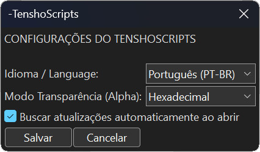

### Como funcionam as opções:
* **Idioma / Language:** Troca o idioma de todos os botões e avisos (Português ou Inglês).
* **Modo Transparência (Alpha):** Como você prefere digitar a transparência nas caixas de texto das ferramentas. Pode ser em código hexadecimal do Aegisub (ex: `&HFF&`) ou uma simples porcentagem de `0 a 100%`.
* **Buscar atualizações automaticamente:** Se marcado, o script olha na internet toda vez que você o abre para ver se tem funções novas e já baixa sozinho.

---

## 1. Fadeworks Adaptado
O Fadeworks serve para fazer o texto aparecer e sumir suavemente (Fade In / Fade Out).

### Como funcionam os botões:
* **Fade In / Fade Out:** O tempo que o texto vai demorar para aparecer no começo e sumir no final.
  * *Dica de Ouro:* Em vez de digitar milissegundos (ex: `500`), você pode digitar um valor decimal (como `0.8`). Isso fará o fade durar exatamente **80% do tempo total da linha**, não importa o tamanho dela!
* **Alpha / Colour:** Se escolher **Alpha**, o texto só fica transparente. Se escolher **Cor (From/To)**, o texto vai mudar de uma cor para outra enquanto aparece.
* **By Letter (Por Letra):** Em vez da linha inteira aparecer de uma vez, cada letra vai aparecendo uma após a outra.
* **Direção:** A ordem em que as letras aparecem (Esquerda para Direita, Direita para Esquerda, etc.).

---

## 2. Gradiente Fácil (Multi-Ponto)
Pinta a sua legenda com um degradê (várias cores se misturando na horizontal). Funciona perfeitamente mesmo selecionando várias linhas ao mesmo tempo.

  <table>
    <tr>
      <td align="center" width="50%">
        <strong>Gradiente Manual</strong> 
        
      </td>
      <td align="center" width="50%">
        <strong>Gradiente por Estilo</strong> 
        
      </td>
    </tr>
  </table>

### Como funcionam os botões:
* **Cores (1 a 5):** Escolha as cores que formarão o degradê.
* **Interpolar HSL:** Deixe marcado! Faz a mistura das cores ficar viva, sem criar manchas cinzas ou marrons no meio.
* **Aplicar em (Target):** Define se a cor vai pintar o interior do texto (`\c`), a borda (`\3c`) ou a sombra (`\4c`).
* **Aba de Estilos:** Permite criar o degradê puxando as cores prontas dos seus Estilos do Aegisub.

---

## 3. Piscadas (Flashes)
Faz a sua legenda piscar rapidamente em outra cor. Perfeito para dar impacto nas batidas fortes da música.

### Como funcionam os botões:
* **Cor do Flash:** A cor que o texto vai ficar quando "piscar".
* **Intervalo (ms):** A velocidade das piscadas. Menor = Mais rápido.
* **Suavizar Transição:** Se desmarcado, pisca de forma seca. Se marcado, a cor pulsa suavemente de uma para outra.

---

## 4. Dividir Linhas
Corta uma frase inteira e transforma cada letra ou palavra em uma linha separada no Aegisub, sem tirar elas do lugar original. 

### Como funcionam os botões:
* **Dividir por Caractere:** Separa letra por letra.
* **Dividir por Palavra:** Separa cortando nos espaços.

---

## 5. Transformar (\t)
Anima a mudança de cores, tamanhos e transparência de um ponto ao outro de forma automática.

### Como funcionam os botões:
* **Início e Fim (ms):** O tempo exato em que a animação acontece. Se deixar o fim zerado, ele dura a linha toda.
* **Cores e Tamanho:** Marque o que você quer mudar e o valor final. (Ex: Marcar Fonte `\fs` para `150` fará o texto crescer até esse tamanho).

---

## 6. Texto & Fontes FX
Um gerador de animações de texto focadas em tipografia.

### Efeitos Disponíveis:
* **Variar Fontes:** Sorteia fontes aleatórias ajustando automaticamente o tamanho de cada uma para nenhuma ficar "espremida".
* **Typewriter (Máquina de Escrever):** O texto é digitado na tela.
* **Embaralhar (Hacking):** Mostra símbolos aleatórios rolando antes de revelar a letra verdadeira.
* **Caos:** Símbolos corrompidos aparecem e somem sozinhos.
* **Inverter:** Espelha a frase de trás pra frente.
* **Pulo Dinâmico (Centralizar):** Faz o texto sempre se reajustar pro meio da tela a cada letra digitada, sem empurrar o resto da frase.

---

## 7. Fixar Linhas
Arruma o posicionamento da sua legenda, convertendo ela para as coordenadas absolutas da tela usando `\pos`.

### Como funcionam os botões:
* **Forçar Topo/Meio/Baixo:** Ignora onde o texto estava e joga ele exatamente no centro matemático superior, central ou inferior do vídeo.

---

## 8. YtktFade
Ferramenta para quem faz karaokê "invisível" focado pro YouTube.

### Como funcionam os botões:
* **Alpha Constante:** Injeta códigos para o YouTube não destruir a qualidade da borda do karaokê na compressão.
* **Ativar \2c:** Escolhe a cor de fundo secundária do karaokê.

---

## 9. Contador Numérico
Gera números animados sozinhos. Ótimo para barras de progresso, carregamentos ou estatísticas na tela.

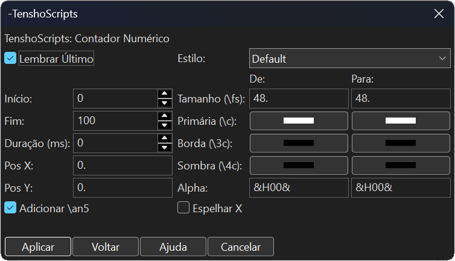

### Como funcionam os botões:
* **Início / Fim:** De qual número ele começa e em qual termina (Ex: 0 a 100).
* **Duração (ms):** Tempo que ele leva para contar. Se deixar `0`, ele conta durante todo o tempo da linha.
* **Pos X / Pos Y:** As coordenadas exatas na tela onde o contador vai aparecer.
* **Adicionar \an5:** Centraliza perfeitamente o número na posição escolhida.
* **De -> Para (Tamanho/Cores):** Você pode fazer o número crescer (Tamanho `\fs`), mudar de cor principal, borda, sombra ou ir aparecendo (Alpha) enquanto conta!

---

## 10. Shake (Tremor)
Faz a legenda tremer na tela, simulando o balanço de uma câmera. O script gera os movimentos automaticamente criando vários `\pos`.

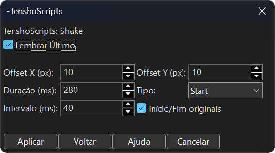

### Como funcionam os botões:
* **Offset X e Y (px):** O limite de pixels que o texto pode pular para os lados (X) e para cima/baixo (Y).
* **Duração (ms):** O tempo total que o tremor vai durar.
* **Intervalo (ms):** A frequência. Um intervalo baixo (ex: `40`) faz um tremor rápido e violento, um intervalo alto faz um balanço lento.
* **Tipo:** Onde o tremor acontece (ex: no "Start" da linha, no fim, etc.).
* **Início/Fim originais:** Mantém as temporizações da linha sem alterar a grade.

---

## 11. Color Tracker
*(Créditos da base original: [Zahuczky](https://github.com/Zahuczky/Zahuczkys-Aegisub-Scripts))*

Um "conta-gotas" contínuo. Ele fica rastreando (seguindo) as mudanças de cor de um único pixel da tela e aplica essa cor na sua legenda.

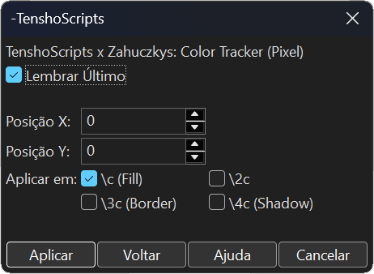

### Como funcionam os botões:
* **Posição X e Y:** O ponto exato da tela que o script vai vigiar.
* **Aplicar em:** Escolha que parte do seu texto vai receber essa cor copiada do vídeo:
  * `\c (Fill)`: O interior do texto.
  * `\2c`: A cor secundária (karaokê).
  * `\3c (Border)`: A borda.
  * `\4c (Shadow)`: A sombra.

---

## 12. Glitch Dinâmico (Pago)
Cria o famoso efeito de "Falha Digital" ou Aberração Cromática. Ele duplica as bordas do texto em cores diferentes e faz elas se separarem e tremerem.

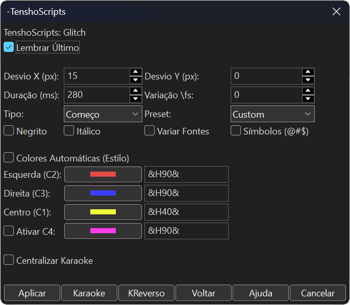

### Como funcionam os botões:
* **Desvio X e Y (px):** A distância máxima que as cores falsas vão se separar do texto original (para os lados ou para cima/baixo).
* **Duração (ms):** O tempo que o efeito vai durar na tela.
* **Variação \fs:** Faz o tamanho do texto "pular" (aumentar e diminuir) aleatoriamente durante o glitch.
* **Tipo:** Escolha se o glitch acontece no **Começo** da linha, no **Fim**, ou **Sempre** (o tempo todo).
* **Caixinhas de Efeito (Negrito, Itálico, Variar Fontes, Símbolos):** Fazem o texto piscar trocando de fonte ou virando símbolos aleatórios (`@#$`) para parecer que o arquivo de vídeo corrompeu de verdade.
* **Cores Automáticas (Estilo):** Puxa as cores direto do seu Estilo do Aegisub. Se desmarcar, você pode escolher manualmente a cor que vai piscar na **Esquerda**, **Direita** e no **Centro** do texto, junto com a transparência (`Alpha`) de cada uma.
* **Centralizar Karaoke:** Se o seu glitch estiver acontecendo sílaba por sílaba com a tag `\k`, essa opção garante que a palavra pule para o centro da tela.

---

## 13. Onda Arco-Íris (Pago)
Faz uma onda de cor varrer o seu texto fluidamente, deslizando pelas letras como água, sem criar milhares de camadas pesadas no seu Aegisub.

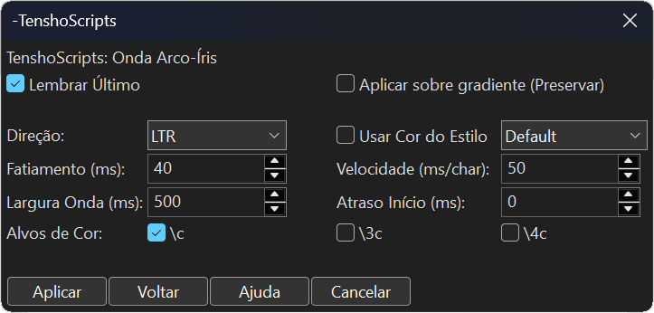

### Como funcionam os botões:
* **Direção:** Para onde a onda vai (Esquerda para Direita, etc.).
* **Fatiamento (ms):** A precisão do corte. Recomendamos deixar em `40` para um movimento extremamente macio que não trava o seu PC.
* **Largura da Onda (ms):** O "tamanho" da onda. Valores maiores fazem a cor demorar mais para atravessar a palavra.
* **Velocidade (ms/char):** O tempo que a onda leva para pular de uma letra para a próxima.
* **Aplicar sobre gradiente:** Marque isso se o seu texto já tiver um degradê original e você não quiser que a onda destrua ele ao passar.
* **Usar Cor do Estilo:** Em vez de um arco-íris colorido padrão, a onda usará uma cor do seu estilo (como a primária ou secundária), servindo como um "brilho" que atravessa o texto.

---

## 14. KaraFX (Karaoke & KReverso) [Pago]
Automatiza efeitos avançados para quem sincroniza sílabas usando a tag `\k`. Substitui plugins velhos de karaokê que quebravam o layout do texto.

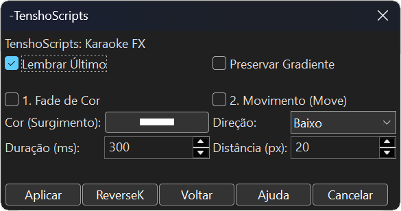

### Como funcionam os botões:
* **1. Fade de Cor:** Faz a sílaba mudar de cor *suavemente* quando for cantada (diferente da troca dura e seca do karaokê normal). Você define a Cor do Surgimento e o tempo.
* **2. Movimento (Move):** Faz a sílaba dar um "pulinho" na direção escolhida (Baixo, Cima, Esquerda, Direita) e na Distância configurada em pixels assim que for cantada.
* **Preservar Gradiente:** Garante que os efeitos acima não destruam o degradê original do seu texto.
* **Botão "KReverso" (Karaokê Reverso):** Ignora os efeitos acima e faz o oposto do karaokê tradicional: o texto inteiro começa na tela e vai **apagando** (sumindo) sílaba por sílaba no exato ritmo do `\k`.

---

## 15. Curvas [Pago] - BETA
Traz a movimentação suave profissional de programas como Premiere e After Effects direto para a tag `\move` do Aegisub.

  <table>
    <tr>
      <td align="center" width="50%">
        <strong>Modo Básico</strong> 
        
      </td>
      <td align="center" width="50%">
        <strong>Modo Avançado (Bézier)</strong> 
        
      </td>
    </tr>
  </table>

### Como funcionam os botões:
* **Presets (In, Out, In-Out):** Acelerações prontas. (Começa devagar e termina rápido, dá um tranco elástico, etc).
* **Modo Avançado (Bézier):** Permite colar os valores matemáticos exatos (x1, y1, x2, y2) que você usa na edição do seu vídeo, pro texto andar e frear na exata mesma velocidade da câmera.

 

  

 

 

  
Desenvolvido por <strong><a href="https://x.com/otenshy">Tensho</a></strong>. MIT License.

