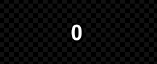
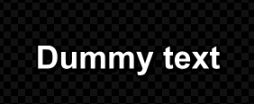
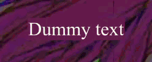

<h1 id="-english"></h1>

  

  <h1>Aegisub - TenshoScripts v2.0.0</h1>

  

    <strong>TenshoScripts</strong> is an essential automation toolkit for Aegisub, specifically developed for the <strong>Nerdcore</strong> and <strong>AMV</strong> scene. This version focuses on fundamental tools to streamline the subtitle workflow for YouTube, now powered by a smart, modular ecosystem.
  

  
   

  
  

---

## ✨ Included Features (Free)

| Tool | Description | Visual Demo |
| :--- | :--- | :---: |
| **Adapted Fadeworks** | Applies standard fades (in/out), alpha/color fades, or letter-by-letter animations (`LTR`, `RTL`, `Middle->Out`, `Out->Middle`). Perfectly preserves original tag timings. |  |
| **Easy Gradient** | Horizontal gradients automatically calculated letter-by-letter using up to 5 key colors or via Styles, supporting multiple lines without breaking layouts. |  |
| **Flashes** | Rhythmic color and transparency alternation to create visual impacts perfectly synced to the music beat. |  |
| **Split Lines** | Divides complex sentences into individual character or word layers, ideal for detailed typographic animations. |  |
| **Transform** | Creates mathematical animation blocks (`\t`) for colors, size (`\fs`), and opacity (`\alpha`), respecting line duration limits. |  |
| **TextFX** | Robust typographic motion suite: Typewriter, Shuffle (Hacking), Mirror Inversion, Symbol Chaos, and Font Variation, with dynamic centering and line-break support. |  |
| **FixLines** | Quick anchored positioning (`\an5`) with precise mathematical calculation for Top, Middle, or Bottom screen placement, regardless of video resolution. |  |
| **YtktFade** | Applies the native invisible YouTube karaoke effect (`\2c` color transition) to multiple lines at once, drastically saving time. |  |
| **Counter** | Generates automated animated numerical progressions, percentages, and timers synced with the video. |  |
| **Shake** | Applies natural or chaotic camera shake effects to subtitles, generating organic frame-by-frame `\pos` coordinates. |  |
| **Color Tracker** | Tracks and follows a specific pixel on the screen, dynamically monitoring and adapting its color variations for visual effects. |  |

> 💡 **Tip:** Learn more about how the automations work in our [User Guide](https://github.com/yujifkw/TenshoScripts/blob/main/HELP.md).

---

## 🛡️ Smart Tag Preservation

One of the biggest frustrations when automating subtitles is losing original formatting. **TenshoScripts** is built with a custom text-processing engine that truly understands Aegisub syntax.

* **Intact Gradients:** Apply complex effects (like Letter-by-Letter Fades or Glitch) without destroying your pre-existing horizontal gradients. The script restitches the colors automatically.
* **Absolute Positioning:** Tools that slice text (like Split Lines or Shake) automatically convert dynamic alignments (`\an`) into absolute coordinates (`\pos`), ensuring characters never shift out of place.
* **Style Maintenance:** The script actively reads your active "Style" and inline tags (`\b1`, `\i1`), keeping borders, shadows, and italics perfectly intact after the effect rendering.

---

## 💎 TenshoScripts + (Paid Version)

Want to level up your subtitles? The **Exclusive** version automates complex effects that were previously only possible in heavy video editing software, with native rendering directly in Aegisub.

| Tool | Description | Visual Demo |
| :--- | :--- | :---: |
| **Dynamic Glitch** | Organic chromatic aberration with automatic color support based on Style, simulating digital failures with axis displacement. |  |
| **Rainbow Wave** | Continuous, smooth chromatic modulation with ultra-precise temporal slicing (40ms), creating flawless fluid waves. |  |
| **KaraFX** | Advanced syllable animation and progressive disappearance system based on original karaoke timings (`\k`). |  |
| **Curves [BETA]** | Advanced movement smoothing utilizing mathematical interpolation via Cubic Bézier Curves directly on the `\move` tag. |  |

 

  

 

---

## 🚀 How to Install (Auto-Update System)

TenshoScripts now features a **Smart Auto-Updater**. You only need to install one file and the script will do the rest!

1. Download the `TenshoScripts.lua` file on the [**Releases**](../../releases) page.
2. Press <kbd>Win</kbd> + <kbd>R</kbd>, type `%APPDATA%\Aegisub` and press Enter.
3. Place the `.lua` file inside the `automation\autoload` folder.
4. Open Aegisub and navigate to `Automation -> -TenshoScripts`.
5. **Done!** On first run, the script will automatically download all necessary tools to your PC.

---

## 🔗 Useful Links

* [**Aegisub-Modified**](https://github.com/arch1t3cht/Aegisub/releases/tag/feature_12): Version with support for **Folders** (line organization) and dark theme.
* [**YTSubConverter**](https://github.com/arcusmaximus/YTSubConverter): Essential converter for the `.ytt` format (YouTube).

---

## ⚖️ License

This project is licensed under the **MIT License**. See the `LICENSE` file for more details.

 

  
Made with ❤️ by <strong><a href="https://x.com/otenshy">Tensho</a></strong>

 
 
 

<h1 id="-português"></h1>

  

  <h1>Aegisub - TenshoScripts v2.0.0</h1>

  

    O <strong>TenshoScripts</strong> é um toolkit essencial de automação para Aegisub, desenvolvido especificamente para legendas da cena <strong>Nerdcore</strong> e <strong>AMVs</strong>. Esta versão foca em ferramentas fundamentais para agilizar o workflow de legendas para YouTube, trazendo agora um ecossistema inteligente e modular.
  

  
   

  
  

---

## ✨ Funcionalidades Inclusas (Gratuito)

| Ferramenta | Descrição | Demonstração Visual |
| :--- | :--- | :---: |
| **Fadeworks Adaptado** | Aplica fades (in/out) normais, por alpha/cor ou animações letra por letra (`LTR`, `RTL`, `Meio->Fora`, `Fora->Meio`). Preserva perfeitamente o tempo das tags originais. |  |
| **Gradiente Fácil** | Gradientes horizontais calculados automaticamente letra por letra com até 5 cores-chave ou via Estilos, suportando múltiplas linhas simultaneamente sem quebrar o layout. |  |
| **Piscadas** | Alternância rítmica de cores e transparência para criar impacto visual sincronizado perfeitamente com a batida da música. |  |
| **Dividir Linhas** | Divide frases complexas em camadas individuais por caractere ou palavra, ideal para criar animações tipográficas detalhadas. |  |
| **Transformar** | Cria blocos de animação (`\t`) com progressão matemática para cores, tamanho (`\fs`) e opacidade (`\alpha`), respeitando os limites da linha. |  |
| **TextFX** | Suíte robusta de motion tipográfico: Typewriter, Embaralhar (Hacking), Inversão Espelhada, Caos e Variação de Fontes, com suporte a centralização dinâmica e quebras de linha. |  |
| **Fixar Linhas** | Posicionamento ancorado rápido (`\an5`) com cálculo matemático preciso para Topo, Meio ou Baixo da tela, independente da resolução do vídeo. |  |
| **YtktFade** | Aplica o efeito de karaokê invisível nativo do YouTube (transição de cor `\2c`) a várias linhas de uma só vez, otimizando o tempo. |  |
| **Contador** | Gera progressões numéricas animadas, porcentagens e cronômetros de forma automatizada e sincronizada com os tempos de vídeo. |  |
| **Shake** | Aplica efeitos de tremor natural ou caótico (Camera Shake) nas legendas, gerando coordenadas `\pos` orgânicas frame a frame. |  |
| **Color Tracker** | Rastreia e segue um pixel específico da tela, acompanhando e adaptando suas variações de cor dinamicamente para efeitos visuais. |  |

> 💡 **Dica:** Veja mais detalhes sobre como as automações funcionam no nosso [Guia de Uso](https://github.com/yujifkw/TenshoScripts/blob/main/HELP.md).

---

## 🛡️ Preservação Inteligente de Tags

Uma das maiores frustrações ao automatizar legendas é perder a formatação original. O **TenshoScripts** foi construído com uma engine de processamento de texto que entende profundamente a sintaxe do Aegisub.

* **Gradientes Intactos:** Aplique efeitos complexos (como Fades por Letra ou Glitch) sem destruir seus gradientes horizontais pré-existentes. O script recostura as cores automaticamente.
* **Posicionamento Absoluto:** Ferramentas que fatiam o texto (como Dividir Linhas ou Shake) convertem alinhamentos dinâmicos (`\an`) para coordenadas absolutas (`\pos`), garantindo que os caracteres não saiam do lugar.
* **Manutenção de Estilos:** O script lê ativamente o seu "Style" atual e as tags inline (`\b1`, `\i1`), mantendo bordas, sombras e itálicos perfeitamente intactos após a renderização do efeito.

---

## 💎 TenshoScripts + (Versão Paga)

Deseja elevar o nível das suas legendas? A versão **Exclusive** automatiza efeitos complexos que antes só seriam possíveis em softwares de edição de vídeo pesados, com renderização nativa direto no Aegisub.

| Ferramenta | Descrição | Demonstração Visual |
| :--- | :--- | :---: |
| **Glitch Dinâmico** | Aberração cromática orgânica com suporte a cores automáticas baseadas no Estilo, simulando falhas digitais com deslocamento de eixo. |  |
| **Onda Arco-Íris** | Modulação cromática contínua e suave com fatiamento temporal de altíssima precisão (40ms), criando ondas fluidas perfeitas. |  |
| **KaraFX** | Sistema avançado de animação de sílabas e desaparecimento progressivo baseado nas marcações originais de karaoke (`\k`). |  |
| **Curvas [BETA]** | Suavização avançada de movimento utilizando interpolação matemática por Curvas de Bézier Cúbicas diretamente na tag `\move`. |  |

 

  

 

---

## 🚀 Como Instalar (Sistema Auto-Update)

O TenshoScripts agora possui um **Auto-Updater Inteligente**. Você só precisa instalar um arquivo e o script fará o resto!

1. Baixe o arquivo `TenshoScripts.lua` na página de [**Releases**](../../releases).
2. Pressione <kbd>Win</kbd> + <kbd>R</kbd>, digite `%APPDATA%\Aegisub` e dê Enter.
3. Coloque o arquivo `.lua` dentro da pasta `automation\autoload`.
4. Abra o Aegisub e acesse `Automação -> -TenshoScripts`.
5. **Pronto!** Na primeira execução, o script baixará automaticamente todas as ferramentas necessárias para o seu PC.

---

## 🔗 Links Úteis

* [**Aegisub-Modified**](https://github.com/arch1t3cht/Aegisub/releases/tag/feature_12): Versão com suporte a **Pastas** (organização de linhas) e tema escuro.
* [**YTSubConverter**](https://github.com/arcusmaximus/YTSubConverter): Conversor essencial para o formato `.ytt` (YouTube).

---

## ⚖️ Licença

Este projeto está sob a licença **MIT**. Veja o arquivo `LICENSE` para mais detalhes.

 

  
Feito com ❤️ por <strong><a href="https://x.com/otenshy">Tensho</a></strong>

